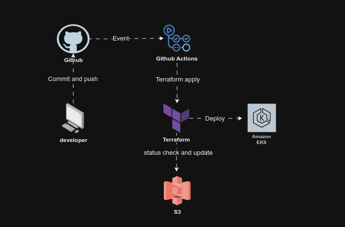

## Objetivo do Projeto

O objetivo é automatizar o processo de criação e manutenção do ambiente para execução dos projetos de Software da Mr. Fusion Solutions.

## Premissas do Projeto

Para o desenvolvimento do projeto, foram estabelecidas as seguintes premissas:

- Utilizar o Terraform como ferramenta de infraestrutura como código.
- Criar o cluster Kubernetes utilizando o serviço Elastic Kubernetes Service (EKS) da AWS.
- Projetar o projeto para ser simples e reaproveitável.
- Executar a pipeline sempre que houver alteração no código Terraform na branch main do repositório.
- Ter apenas um ambiente Kubernetes (os ambientes de desenvolvimento, homologação e produção serão separados por namespace).

## Tecnologias Utilizadas no Projeto

- [AWS](https://aws.amazon.com)
  - [S3](https://aws.amazon.com/s3)
  - [EKS](https://aws.amazon.com/eks)
- [AWS CLI](https://aws.amazon.com/cli/)
- [Terraform](https://www.terraform.io)
  - [AWS Provider](https://registry.terraform.io/providers/hashicorp/aws)
  - [AWS VPC Terraform module](https://registry.terraform.io/modules/terraform-aws-modules/vpc/aws)
  - [AWS EKS Terraform module](https://registry.terraform.io/modules/terraform-aws-modules/eks/aws)
- [GitHub](https://github.com)
  - [GitHub Actions](https://github.com/features/actions)

## Motivações para o Uso de Cada Tecnologia

- **EKS**: Requisito do projeto.
- **S3**: Utilizado para armazenar o estado atual do projeto Terraform devido ao seu controle de versionamento e ser um serviço da AWS.
- **GitHub Actions**: Requisito do projeto.

## Instruções para Execução

A pipeline de criação ou atualização do projeto é executada sempre que o código Terraform do projeto for alterado na branch main.

## Configurações

As variáveis de configuração do projeto estão no arquivo `terraform.tfvars`, exceto as variáveis consideradas sensíveis que estão no gerenciador de secrets do GitHub Actions.

**Variáveis armazenadas em secrets:**

- `AWS_ACCESS_KEY_ID`: Access Key utilizada para configurar o AWS CLI.
- `AWS_SECRET_ACCESS_KEY`: Secret access Key utilizada para configurar o AWS CLI.
- `AWS_BUCKET_NAME`: Nome do Bucket utilizado para armazenar o estado do projeto Terraform.
- `AWS_BUCKET_FILE`: Nome do arquivo utilizado para armazenar o estado do projeto Terraform.

## Estrutura da Solução

Explicação do Fluxo

## Possíveis Evoluções do Projeto

Algumas evoluções sugeridas para o projeto:

- Separar ambientes dev, homolog e prod utilizando o Terraform Workspace ou Terraform Grunt para criação e gerenciamento desses ambientes.
- Utilizar o DynamoDB junto com o S3 para evitar execução paralela do Terraform.

...

---

